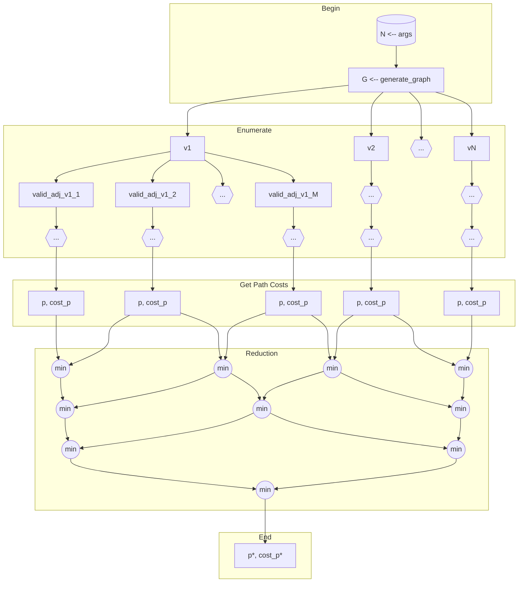

**Turma: A**

**Número do Grupo: 01**

**Nomes dos integrantes deste grupo que resolveram o trabalho:**

- Karoliny Oliveira Ozias Silva 10368020
- João Lucas Rodrigues Constantino 11795763
- Luiz Fernando Silva Eugênio dos Santos 10892680
- Alexandre Brito Gomes 11857323


# Execução

Para executar o programa, entre no terminal:

```
make runpar
```

ou

```
make runseq
```

para executar respectivamente as versões paralela e sequencial. Os parâmetros **N** e **NUM_PROCS** declarados no `Makefile` determinam respectivamente o número de processos a serem usados e de cidades no problema. Por padrão, ambos são definidos como **8**. A aplicação foi desenvolvida considerando um número de cidades maior ou igual ao número de processos. 


# MPI Travelling Salesman

O problema do caixeiro viajante consiste em, dado um grafo direcionado representando uma cidade e suas respectivas conexões entre si, encontrar o menor percurso hamiltoniano, isto é, aquele que, ao percorrer todas as cidades única vez cada, resulta na menor distância possível. Nesse contexto, propõe-se uma solução exaustiva para o problema, isto é, via enumeração total, visando a determinar o ganho de desempenho de uma aplicação paralela sobre sua correspondente sequencial. Para tanto, será utilizada a linguagem C, juntamente às bibliotecas OpenMP e MPI, a fim de construir ambas as versões do código. Assim sendo,  a fim de se propor um projeto de paralelização, a análise PCAM será utilizada -- sendo ela referente às técnicas de Particionamento, Comunicação, Aglomeração e Mapeamento. 

## Particionamento

Considere um grafo $G$ como uma tupla $\left(V, A \right)$, sendo $V$ o conjunto de vértices desse grafo, e $A$ o seu conjunto de arestas. Desse modo, sendo $N = \left| V \right|$, pode-se enumerar os vértices como $\lbrace v_1, v_2, \dots, v_N \rbrace$; considere, ainda, $adj(v_i)$, $i\in \lbrace 1,2,\dots,N \rbrace$, como o conjunto de vértices adjacentes ao nó $v_i$, isto é, $adj(v_i) = \lbrace v_j \mid \exists \left( v_i, v_j \right) \in A \rbrace $. Daí, dado um caminho $p$ contendo uma sequência de vértices, pode-se definir ${valid \textunderscore adj} p(v_i) = \lbrace v_j \mid \exists \left( v_i, v_j \right) \in A  \land v_j \notin p \rbrace$, isto é, o conjunto de vértices acessíveis a seguir que não pertençam ao caminho previamente percorrido, e $cost\left(p\right) = \sum_{i=1}^{\left| p \right|} c_{i-1, i}$, em que $c_{i,j}$ é o peso da aresta $\left( v_i, v_j \right)$, como o custo total do caminho $p$. Por fim, considerando $M_{pv_i} = \left| {valid\_adj}_{p}(v_i) \right|$, propõe-se o seguinte grafo de dependências de tarefas:



Logo, inicia-se convertendo o argumento de linha de comando no parâmetro $N$ do problema, que será utilizado para gerar um grafo densamente conectado de maneira pseudoaleatória. Daí, uma vez obtido $G$, dá-se início ao processo de enumeração dos possíveis caminhos existentes: isso é realizado por meio de um particionamento por dados, em que cada tarefa recebe um nó inicial e, a partir dele, constrói um caminho de maneira recursiva, a cada passo enumerando todas as possibilidades e as passando para novas tarefas. Ao final da enumeração, computa-se o custo total de cada um dos caminhos construídos, iniciando -- então -- o processo de redução por minimização -- isto é, dois a dois, seleciona-se o caminho de custo mínimo, finalizando essa etapa ao selecionar o caminho ótimo $p^*$ e seu respectivo $cost(p^*)$.

## Comunicação

Para este problema, a comunicação segue o fluxo de dados do grafo de dependências das tarefas. Em geral, a comunicação entre tarefas ocorre nas fases de redução binária. Além disso, como cada tarefa recebe uma partição disjunta das restantes, não há compartilhamento de secções entre elas.

## Aglomeração

Devem ser considerados tantos processos quanto unidades de processamento existentes no sistema computacional em uso. Assim sendo, as tarefas de enumeração de caminhos podem ser disponibilizadas em uma *pool*, sendo consumidas pelos processos conforme demanda de execução. Em geral, a computação será distribuída e, como tal, não haverá compartilhamento de regiões críticas.

## Mapeamento

Considera-se execução realizada em um *cluster* contendo processadores homogêneos, dividindo-se, de maneira estática, os aglomerados obtidos ao longo dos processadores do sistema computacional.
