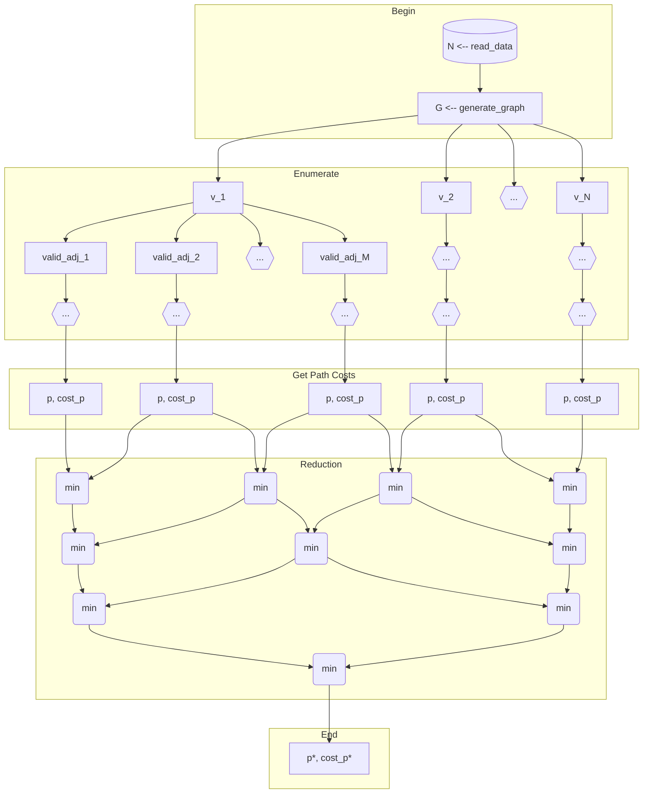

# MPI Travelling Salesman

Considere um grafo $G$ como uma tupla $\left(V, A \right)$, sendo $V$ o conjunto de vértices desse grafo e, $A$, o seu conjunto de arestas. Desse modo, sendo $N = \left| V \right|$, pode-se enumerar os vértices como $\{ v_1, v_2, \dots, v_N \}$; considere, ainda, $adj(v_i)$, $i\in\left[1,N\right]\subset\N$, como o conjunto de vértices adjacentes ao nó $v_i$, isto é, $adj(v_i)=\{v_j \mid \exists \left( v_i, v_j \right) \in A \}$. Daí, dado um caminho $p$ contendo uma sequência de vértices, pode-se definir ${valid\_adj}_{p}(v_i) = \{ v_j \mid \exists \left( v_i, v_j \right) \in A  \land v_j \notin p \}$, isto é, o conjunto de vértices acessíveis a seguir que não pertençam ao caminho previamente percorrido, e $cost\left(p\right) = \sum_{i=1}^{\left| p \right|} c_{i-1, i}$, em que $c_{i,j}$ é o peso da aresta $\left( v_i, v_j \right)$. Por fim, considerando ${M}_{pv_i} = \left| {valid\_adj}_{p}(v_i) \right|$, propõe-se o seguinte grafo de dependências de tarefas:

